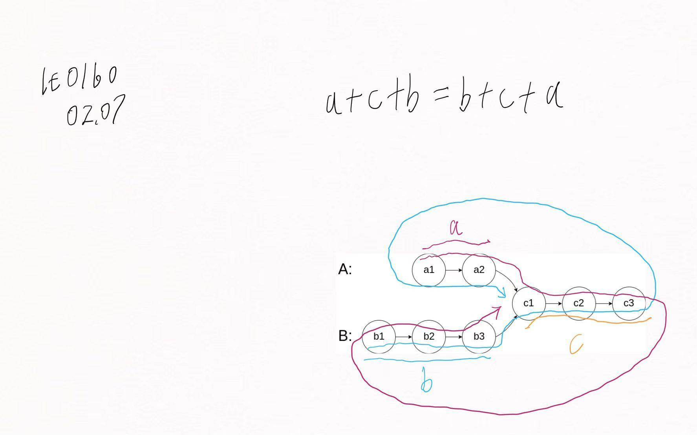

# Day04.两两交换链表节点、删除倒数第N个节点、环形链表.md

## 0024.两两交换链表中的节点

链接：[0024.两两交换链表中的节点](https://leetcode.cn/problems/swap-nodes-in-pairs/)

思路：借助虚拟头节点。因为是交换两个节点，所以需要借助更前一个节点来完成。

```c++
class Solution {
public:
    ListNode* swapPairs(ListNode* head)
    {
        ListNode* vHead = new ListNode(0, head);
        ListNode* cur = vHead;
        while (cur->next && cur->next->next) {
            ListNode* n1 = cur->next;
            ListNode* n2 = n1->next;
            n1->next = n2->next;
            n2->next = n1;
            cur->next = n2;
            cur = n1;
        }
        ListNode* res = vHead->next;
        delete vHead;
        return res;
    }
};

```

## 0019.删除链表的倒数第N个结点

链接：[0019.删除链表的倒数第N个结点](https://leetcode.cn/problems/remove-nth-node-from-end-of-list/)

思路：删除倒数第N个节点，一定要找到倒数第N个节点的前一个节点。借助虚拟头节点，可以方便的定位待删除节点的前一个节点。借助双指针，一个指针从head开始先走N-1步（倒数第N，N是从1开始的）。
然后另一个指针从vHead开始，两个指针同时后移，直到快指针指向最后一个元素。此时慢指针指向倒数第N的节点的前一个节点。

```c++
class Solution {
public:
    ListNode* removeNthFromEnd(ListNode* head, int n)
    {
        if (!head) {
            return head;
        }
        ListNode* vHead = new ListNode(0, head);
        ListNode* fast = head;
        ListNode* prev = vHead;
        for (int i = 1; i < n; ++i) {
            fast = fast->next;
        }
        while (fast->next) {
            fast = fast->next;
            prev = prev->next;
        }
        ListNode* d = prev->next;
        prev->next = d->next;
        delete d;
        ListNode* res = vHead->next;
        delete vHead;
        return res;
    }
};

```

## 0160.相交链表

链接：[0160.相交链表](https://leetcode.cn/problems/intersection-of-two-linked-lists/)

思路：如图。沿着一条链表走完后，走到空时，走另一条链表。如果两条链表不相交，那么最后两个指针都为空。
两个指针最终走的长度一定是一样的，不管是否相交。



```c++
class Solution {
public:
    ListNode* getIntersectionNode(ListNode* headA, ListNode* headB)
    {
        ListNode* a = headA;
        ListNode* b = headB;
        while (a != b) {
            if (a) {
                a = a->next;
            } else {
                a = headB;
            }
            if (b) {
                b = b->next;
            } else {
                b = headA;
            }
        }
        return a;
    }
};

```


## 0142.环形链表II

链接：[0142.环形链表II](https://leetcode.cn/problems/intersection-of-two-linked-lists/)

解题思路参考：[代码随想录](https://programmercarl.com/0142.%E7%8E%AF%E5%BD%A2%E9%93%BE%E8%A1%A8II.html)

判断链表是否有环：使用快慢指针法，分别定义 fast 和 slow 指针，从头结点出发，fast指针每次移动两个节点，slow指针每次移动一个节点，如果 fast 和 slow指针在途中相遇 ，说明这个链表有环。

环的入口：如图。


假设从头结点到环形入口节点的节点数为x。环形入口节点到fast指针与slow指针相遇节点节点数为y。从相遇节点再到环形入口节点节点数为z。

相遇时：slow指针走过的节点数为：`x+y`，fast走过的节点数为`x+y+n(y+z)`。fast可能已经在圈内走了n圈，然后才和slow相遇。

因为slow每次走一个节点，fast每次走两个节点。那么fast走的节点数目时slow的两倍。即，`2(x+y)=x+y+n(y+z)`。

化简：`x+y=n(y+z)`。

因为需要知道，环的入口，所以需要知道环的入口相对于头节点的位置，才能定位入口节点。即需要x。

那么式子可以化为：`x=n(y+z)-y`。

进而化为：`x=(n-1)(y+z)+z`。这个式子意味着，当快慢指针相遇时，一个指针从头节点出发，一个从相遇位置出发，在相遇节点出发的那个指针走了n-1圈加z步后，头节点出发的指针正好走了x步。
二者相遇，相遇处就是环的入口处。

```c++
class Solution {
public:
    ListNode* detectCycle(ListNode* head)
    {
        ListNode* fast = head;
        ListNode* slow = head;
        while (fast && fast->next) {
            fast = fast->next->next;
            slow = slow->next;
            // 相遇
            if (fast == slow) {
                // 一个指针从相遇处出发
                ListNode* z = fast;
                // 一个指针从头节点出发
                ListNode* h = head;
                while (z != h) {
                    z = z->next;
                    h = h->next;
                }
                // 两个指针相遇的地方就是环的入口点
                return z;
            }
        }
        return nullptr;
    }
};

```
